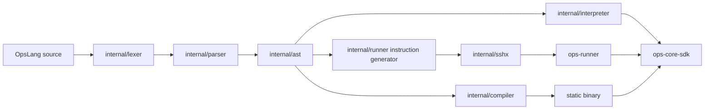
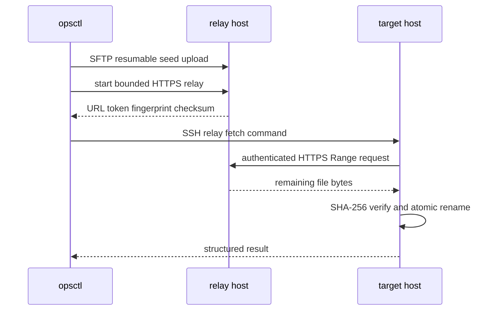

# OpsLang 系统架构

## 概述

OpsLang 是使用 Go 实现的运维领域语言和执行平台。用户通过 `.ops` 脚本描述系统查询、文件变更、进程与服务管理等操作，`opsctl` 负责解释执行、AOT 编译或通过 SSH 调度远端 `ops-runner`。

项目采用三套执行路径：解释器适合本地运行和 REPL，Runner 执行 JSON 指令包，AOT 编译器生成静态 Go 二进制。`internal/opsspec/spec.go` 维护原子操作名称、参数和作用域，测试负责检查解释器、Runner registry 与 AOT codegen 的一致性。

远端目标只需要 SSH。控制端检测目标架构并传输静态 Runner 或 AOT 二进制。文件分发与收集使用 SFTP；显式启用时，分发支持部分文件续传、内容哈希去重和临时 HTTPS 分层中继。

## 技术栈

| 类别 | 实现 |
|------|------|
| 语言 | Go 1.26 |
| CLI | Cobra |
| SSH/SFTP | `golang.org/x/crypto/ssh`, `github.com/pkg/sftp` |
| 系统信息 | gopsutil v4 |
| 数据格式 | 标准库 JSON、`gopkg.in/yaml.v3` |
| 外部集成 | Vault、etcd、ZooKeeper |
| 测试 | Go `testing`、race detector、真实进程与受控 SSH/SFTP 测试 |
| CI | GitHub Actions，Linux runner，多平台静态构建 |

## 项目结构

```text
opslang/
|-- cmd/
|   |-- opsctl/              # 控制端 CLI
|   `-- ops-runner/          # JSON 指令与 relay 子命令执行器
|-- internal/
|   |-- lexer/               # 词法分析
|   |-- parser/              # 递归下降语法分析
|   |-- ast/                 # 语法树类型
|   |-- interpreter/         # 本地解释执行与 SDK 桥接
|   |-- compiler/            # AOT 代码生成、构建和缓存
|   |-- runner/              # 指令协议、registry 和执行器
|   |-- sshx/                # SSH 连接池、命令与 SFTP
|   |-- exec/                # 多主机远程执行
|   |-- inventory/           # 主机清单与目标选择
|   |-- security/            # 权限、审批、审计和签名
|   `-- opsspec/             # 原子操作单一事实源
|-- pkg/ops-core-sdk/        # 可独立调用的原子操作包
|-- examples/                # OpsLang 示例脚本
|-- docs/                    # 用户与设计文档
|-- tools/docgen/            # 原子操作索引生成器
`-- .github/workflows/       # CI 工作流
```

## 主要入口

| 入口 | 职责 |
|------|------|
| `cmd/opsctl/main.go` | 注册 `exec`、`run`、`repl`、`build`、`deploy`、`version` 命令 |
| `cmd/ops-runner/main.go` | 校验并执行指令包，映射退出码，分派 relay 子命令 |
| `internal/opsspec/spec.go` | 定义原子操作契约和可用范围 |
| `pkg/ops-core-sdk/file/distribute.go` | 文件分发调度、重试、校验和结果聚合 |

## 子系统

### 语言前端

`internal/lexer` 把源码转换为带行列信息的 token，`internal/parser` 生成 `internal/ast` 节点。解释器维护作用域、函数和内置操作，并通过 `sdk_bridge.go` 调用标准库。

### 执行引擎

解释路径直接遍历 AST。Runner 路径把操作编码为协议版本 `1.0` 的 JSON 指令包，由 registry 分派。AOT 路径把 AST 生成 Go 源码，再使用 `CGO_ENABLED=0` 构建目标平台二进制。

### SSH 控制面

`internal/sshx` 负责认证、主机密钥策略、连接池、命令超时、架构检测和 SFTP。`internal/exec` 在并发限制内调用 SSH，并聚合每台主机的结构化结果。

### 文件传输

默认路径直接使用 SFTP。`resume=true` 使用最终路径旁的 `.opslang.part` 和 `.opslang.part.json`，验证源大小、SHA-256、确认偏移和确认块后继续传输，完整校验通过后原子替换。`compress=true` 将续传对象改为 gzip 字节流，传输完成后在临时文件解压并校验原始内容，再原子替换最终文件。

`relay=true` 时，计划器按显式中继组、标签或 IP 前缀分组。控制端给每组候选上传一份种子，候选运行带随机令牌和 TLS 指纹固定的临时单文件 HTTPS 服务，同组目标通过 Range 请求拉取。候选失败会稳定切换，未完成目标回退到直接 SFTP。

### 安全

权限级别覆盖只读、管理员和 root 操作。AOT 编译期、解释器运行时和 Runner 执行时分别检查权限。指令包可使用 Ed25519 签名，生产目标可接入审批，执行记录进入审计日志。

## 数据流



## 远程分发时序



## 关键不变量

- 成功或跳过的文件结果必须与源大小和 SHA-256 一致。
- 未完整校验的部分文件不能替换最终文件。
- 每个输入目标必须产生且只产生一个结果。
- 默认关闭恢复和中继，保持直接 SFTP 路径。
- 中继不会接收同组目标的 SSH 密码或私钥。

## 当前边界

- 中继仅用于控制器侧 `file.distribute`，文件收集支持 SFTP 断点续传。
- 中继 HTTPS 地址必须从目标可达；监听和广告地址由部署网络决定。
- 原子操作索引由 `tools/docgen` 生成，实际操作全集以 `internal/opsspec/spec.go` 为准。
