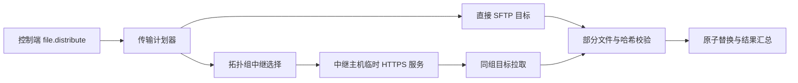

# 断点续传与分层中继技术设计

Feature Name: resumable-relay-transfer
Updated: 2026-09-03

## Description

本设计扩展现有 `file.distribute` 和 `file.collect` 的传输实现。普通目标继续使用现有 SSH/SFTP 连接；恢复传输通过部分文件、偏移量和最终哈希校验复用已完成字节；大规模分发在显式启用中继后按拓扑组选择中继主机，控制端向每组中继发送一份主体，中继通过临时 HTTPS 服务向同组目标提供文件。

实现保持 SDK 的控制器侧边界，解释器只负责把新增选项转换为 SDK 结构体。现有默认选项保持直接 SFTP 行为，避免改变已有脚本的网络路径。

## Architecture



### 组件职责

1. `pkg/ops-core-sdk/file/resume.go`：定义恢复传输的元数据、部分文件命名、前缀校验和原子提交辅助函数。
2. `internal/sshx/sftp.go`：提供带偏移量的上传、下载、远程 stat、远程前缀读取和原子 rename 原语。
3. `pkg/ops-core-sdk/file/distribute.go`：在目标级别执行内容寻址、恢复上传、最终校验和重命名。
4. `pkg/ops-core-sdk/file/collect.go`：在目标级别执行恢复下载、最终校验和本地原子重命名。
5. `pkg/ops-core-sdk/file/relay.go`：根据目标标签和地址建立拓扑组，生成稳定中继计划，并记录回退目标。
6. `pkg/ops-core-sdk/file/relay_http.go`：创建带随机会话令牌的临时 HTTPS 文件服务，限制路径、请求方法、过期时间和并发数。
7. `internal/interpreter/sdk_bridge.go`：解析 `resume`、`relay`、`relay_group`、`relay_threshold` 和 `relay_max_targets` 选项。
8. `internal/inventory` 与 `internal/exec`：保留已有 `Tags`，将中继相关标签传递给控制器侧文件传输调用。

## Components and Interfaces

### Transfer options

扩展 `DistributeOptions`：

```go
type DistributeOptions struct {
    Checksum          bool
    Mode              string
    Parallel          int
    Timeout           time.Duration
    Retries           int
    Resume            bool
    Relay             bool
    RelayGroup        string
    RelayThreshold    int
    RelayMaxTargets   int
    PartRetention     time.Duration
}
```

扩展 `CollectOptions`：

```go
type CollectOptions struct {
    DestDir           string
    Parallel          int
    Timeout           time.Duration
    Retries           int
    Resume            bool
    PartRetention     time.Duration
}
```

保留 JSON 字段命名与 Go 字段一致的 snake_case 形式。`RelayThreshold` 默认 20，`RelayMaxTargets` 默认 100，`PartRetention` 默认 24 小时。`Resume` 和 `Relay` 默认 `false`。

### Target topology metadata

扩展分发目标：

```go
type DistributeTarget struct {
    Host       string            `json:"host"`
    Port       int               `json:"port"`
    User       string            `json:"user"`
    Dest       string            `json:"dest"`
    RelayGroup string            `json:"relay_group,omitempty"`
    Tags       map[string]string `json:"tags,omitempty"`
}
```

`RelayGroup` 显式值优先于 `Tags["relay_group"]`。缺少两者时，计划器对 `Host` 解析地址，IPv4 使用 `/24`，IPv6 使用 `/64`。地址解析失败的目标使用唯一直接传输组。

### Resume metadata

每个部分文件旁边保存 JSON 元数据：

```go
type PartialMetadata struct {
    Version       int    `json:"version"`
    SessionID     string `json:"session_id"`
    SourceSize    int64  `json:"source_size"`
    SourceSHA256  string `json:"source_sha256"`
    ConfirmedSize int64  `json:"confirmed_size"`
    UpdatedAt     time.Time `json:"updated_at"`
}
```

部分文件命名使用最终路径加 `.opslang.part`，元数据使用 `.opslang.part.json`。目标最终路径只在大小和 SHA-256 均匹配时被视为已完成。元数据写入使用临时文件和 rename，防止中断产生可解析但不完整的记录。

### SFTP resume protocol

上传流程：

1. 计算本地源文件大小和 SHA-256。
2. 读取远端最终文件的大小和 SHA-256；匹配时返回 skipped。
3. 读取远端部分文件大小和元数据。
4. 元数据的源大小、源哈希和确认偏移有效时，读取远端部分文件尾部附近的确认块进行前缀一致性校验。
5. 通过 `OpenFile`、`Seek` 或等价的 SFTP offset 写入，从确认偏移继续。
6. 每个确认块写入后更新元数据；传输中断时保留部分文件和元数据。
7. 传输完成后重新计算远端完整 SHA-256，成功后 rename 到最终路径，并删除元数据。

下载流程：

1. 读取远程源文件大小和 SHA-256。
2. 计算本地最终文件；大小和哈希匹配时返回 skipped。
3. 读取本地部分文件和元数据，使用远程大小和哈希验证可恢复条件。
4. 从确认偏移请求远程文件剩余内容并追加到部分文件。
5. 下载完成后计算本地 SHA-256，成功后 rename 到最终路径，并删除元数据。

SFTP 原语必须接受 `context.Context`。所有打开的文件和 SFTP 客户端使用 `defer` 关闭；上下文取消返回原始取消错误，同时保留可恢复状态。

### Relay planning

```go
type RelayPlan struct {
    Groups []RelayGroupPlan `json:"groups"`
}

type RelayGroupPlan struct {
    Key      string
    Relay    *DistributeTarget
    Targets  []DistributeTarget
    Direct   []DistributeTarget
}
```

计划器只在 `Relay=true` 且组内目标数大于或等于 `RelayThreshold` 时生成中继组。中继候选按以下稳定规则排序：显式 `relay=true` 标签、可达性探测结果、主机名字典序。当前实现使用连接建立作为可达性确认，探测失败的候选直接跳过。每个中继最多承载 `RelayMaxTargets` 个目标，超出部分拆分为新的子组。

中继交付过程：

1. 控制端选择中继目标并通过现有 SFTP 恢复上传到会话临时路径。
2. 中继启动临时 HTTPS 服务，只暴露该会话的单个文件。
3. 服务地址、随机令牌、过期时间、SHA-256 和证书公钥指纹通过受保护的 SSH 指令包发送给同组目标。
4. 目标通过 HTTPS Range 请求恢复拉取，校验证书指纹、令牌、大小和 SHA-256，然后原子替换。
5. 中继或目标失败时，计划器重新选择候选；候选耗尽后，对未完成目标执行直接 SFTP。
6. 控制端等待组内结果和临时服务退出确认，超时则关闭服务并记录 warning。

中继服务监听回环或目标可访问的临时地址，具体绑定地址由现有 SSH 网络连通性配置决定。服务不得接受任意路径、任意方法或无令牌请求。

## Correctness Properties

1. **原子最终文件**：任何失败或取消路径都不会把未完成部分文件命名为最终路径。
2. **恢复前缀安全**：恢复写入偏移量只能来自同时匹配源大小、源哈希和确认数据的元数据。
3. **最终完整性**：返回 success 或 skipped 的文件，其大小和 SHA-256 与源文件一致。
4. **计划确定性**：相同目标顺序、标签、地址和选项产生相同拓扑组与中继候选顺序。
5. **中继流量约束**：每个拓扑组最多产生一份中继主体上传；直接回退目标各自产生一份主体上传。
6. **结果守恒**：每个输入目标对应一个结果，结果总数等于输入目标数，状态计数总和等于结果总数。
7. **会话隔离**：不同传输会话使用不同部分文件会话 ID、HTTPS 令牌和临时服务生命周期。
8. **默认兼容**：`Resume=false` 且 `Relay=false` 时，现有直接 SFTP 路径和公共结果字段保持行为一致。

## Error Handling

- 源文件不存在、目标地址为空或选项为负值：在调用开始阶段返回带字段名的参数错误。
- 部分文件元数据损坏：记录恢复警告，删除或忽略元数据，按完整传输继续。
- 部分文件前缀不匹配：从零重建部分文件，保留最终文件原内容。
- 远端 rename 失败：返回 failed，部分文件可保留以供后续重试，最终文件不标记成功。
- HTTPS 令牌过期、证书指纹不匹配或哈希不匹配：拒绝替换并触发同组候选或直接 SFTP 回退。
- 中继服务无法启动：记录中继失败原因，直接向组内目标传输。
- 上下文取消：停止当前 I/O，关闭连接，保留合法部分状态，返回 `context.Canceled` 或 `context.DeadlineExceeded` 包装错误。
- 清理失败：不覆盖原始传输错误，在结果 warning 中记录清理错误。

## Test Strategy

### Unit tests

- 部分文件名、元数据编解码、过期判断、源哈希变化和空文件边界。
- 本地恢复上传和下载的偏移、前缀不匹配、超大部分文件和原子替换。
- SFTP pipe 测试覆盖远程 stat、offset 写入、Range 下载和上下文取消。
- 拓扑标签优先级、IPv4 `/24`、IPv6 `/64`、解析失败直传、稳定排序和 100 台拆组。
- 中继令牌、路径限制、过期拒绝、证书指纹拒绝、并发上限和服务清理。

### Integration and scale tests

- 使用现有 SSH/SFTP 测试服务器验证真实上传、恢复、校验和 rename。
- 使用虚拟 SFTP 和 HTTP transport 验证中继成功、候选失败和直接回退。
- 扩展 1000/10000 主机模拟测试，断言结果守恒、成功率、主体字节计数和中继组流量上界。
- 运行 `go test -p 1 -timeout 45m ./...`、`go vet ./...`、`make docs-check` 和 `make build-all`。

## Rollout

第一阶段只交付本地和 SFTP 断点续传，默认关闭；第二阶段加入拓扑计划器和虚拟中继传输测试；第三阶段接入真实临时 HTTPS 服务和远端目标拉取。每阶段完成后更新 SDK 文档、CLI 文档和状态报告。

## References

- `pkg/ops-core-sdk/file/distribute.go`
- `pkg/ops-core-sdk/file/collect.go`
- `pkg/ops-core-sdk/file/ssh_transfer.go`
- `internal/sshx/sftp.go`
- `internal/inventory/inventory.go`
- `internal/exec/exec.go`
