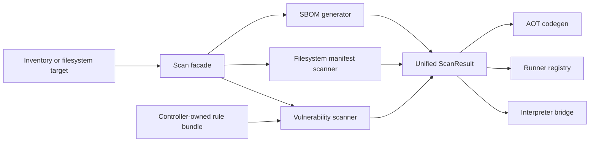

# Trivy 能力集成技术设计

Feature Name: trivy-capability-integration
Updated: 2026-09-06

## Description

本设计将 Trivy 的能力模型引入 OpsLang，第一阶段聚焦主机软件漏洞、文件系统依赖识别和 SBOM 生成。设计复用现有软件清单、漏洞匹配、解释器、Runner、AOT 和结构化审计链路，目标主机只运行静态 Go 二进制。

第一阶段不执行 Trivy 二进制，不依赖 Python、Shell、Docker daemon 或 Kubernetes 客户端。规则更新由控制端负责；扫描支持目标机本地规则 bundle 和控制端 HTTPS 远程匹配两种模式。容器镜像、Kubernetes、IaC、密钥和许可证扫描保留统一扩展接口，后续逐项接入。

## Architecture



### Execution Paths

1. **SDK**：`pkg/ops-core-sdk/securityscan` 提供强类型扫描接口和统一结果类型。
2. **Interpreter**：`security.scan`、`software.sbom` 和 `file.scan` 接收动态值，返回可访问字段的动态对象。
3. **Runner**：registry 校验参数并调用 SDK；指令包携带扫描器、限制和规则摘要。
4. **AOT**：codegen 生成对应 SDK 调用，导入包顺序由固定列表保持稳定。
5. **CLI**：第一阶段提供 `opsctl scan`，用于扫描本地目录或主机清单并输出 JSON。

## Components and Interfaces

### 0. Remote Vulnerability Query

控制端使用 `opsctl vulndb serve` 暴露只读 HTTPS API：`POST /v1/security/vulnerabilities/match`。Runner 通过任务 options 接收 `remote.url`、`remote.token`、`remote.rule_version` 和 `remote.rule_sha256`，发送软件清单并接收 Findings。服务端只返回匹配结果和规则来源元数据，不返回完整规则库。

服务端使用 TLS 证书和任务级 Bearer token。客户端强制 `https` URL，支持额外 CA bundle，默认请求超时 30 秒，响应体上限 4 MiB。规则版本或摘要不一致时扫描失败。

### 1. Unified Scan Package

建议新增包 `pkg/ops-core-sdk/securityscan`，避免将多个扫描器的动态适配逻辑堆积到现有 `vulnerability` 包。

```go
type Scanner string

const (
    ScannerVulnerability Scanner = "vuln"
    ScannerSBOM           Scanner = "sbom"
    ScannerMisconfig      Scanner = "misconfig"
    ScannerSecret         Scanner = "secret"
    ScannerLicense        Scanner = "license"
)

type Options struct {
    Scanners       []Scanner `json:"scanners"`
    RuleBundle     []byte        `json:"-"`
    RuleBundleHash string        `json:"rule_bundle_hash,omitempty"`
    Remote         *RemoteConfig `json:"remote,omitempty"`
    IgnorePaths    []string  `json:"ignore_paths,omitempty"`
    MaxFileSize    int64     `json:"max_file_size,omitempty"`
    MaxDepth       int       `json:"max_depth,omitempty"`
    Timeout        time.Duration `json:"timeout,omitempty"`
    Severity       string    `json:"severity,omitempty"`
    Format         string    `json:"format,omitempty"`
}

type ScanResult struct {
    Target       TargetInfo          `json:"target"`
    Scanners     []Scanner           `json:"scanners"`
    Status       string              `json:"status"`
    Findings     []VulnerabilityFinding `json:"findings,omitempty"`
    Components   []SBOMComponent     `json:"components,omitempty"`
    Errors       []ScanError         `json:"errors,omitempty"`
    RuleSource   RuleSourceInfo      `json:"rule_source,omitempty"`
    StartedAt    time.Time           `json:"started_at"`
    FinishedAt   time.Time           `json:"finished_at"`
}
```

`ScanResult` 保持空切片初始化，便于 JSON 消费者区分空结果和缺失字段。第一阶段未实现的 scanner 返回能力错误，结果状态保持 `unsupported`。

### 2. Vulnerability Scanner

漏洞扫描器复用 `vulnerability.Match` 的版本比较逻辑，并增加：

- 严重级别过滤。
- 规则 bundle 身份和 SHA-256 摘要。
- 忽略规则按漏洞 ID、包名和路径匹配。
- 规则 bundle 版本校验。
- 结果去重和稳定排序。

现有 `vulnerability.Match` 和 `MatchValue` 保持兼容，统一扫描接口通过适配层调用。已有 `vulnerability.match` OpsLang 操作保留，用于低层规则匹配；新增扫描接口承载 Trivy 风格的元数据和多个 scanner。

### 3. Filesystem Manifest Scanner

第一阶段支持以下清单来源：

- Debian `dpkg` 状态文件和已安装包信息。
- RPM 数据库可见包信息。
- Go `go.mod` 与 `go.sum`。
- Node.js `package.json` 与锁文件中的直接依赖。
- Python `requirements.txt` 与 `pyproject.toml` 的固定版本依赖。

扫描器使用 `filepath.WalkDir`，不调用 shell。每个解析器返回组件和局部错误；单个文件失败不会丢弃其他结果。默认跳过 `.git`、`node_modules`、`.venv`、缓存和构建输出目录，用户可通过 `IgnorePaths` 覆盖或追加规则。

### 4. SBOM Generator

SBOM 生成器从 `software.InventoryResult` 或文件系统组件集合构建稳定组件列表。组件 ID 使用生态系统、名称和版本的规范化组合；同一组件的多个路径保留在 `Locations` 中。

第一阶段输出：

- OpsLang 原生对象。
- CycloneDX JSON 的最小有效字段集合。
- SPDX JSON 的最小有效字段集合。

生成器不会伪造未知许可证、来源和哈希字段，缺失值使用空值或未知状态表示。

### 5. Rule Bundle

规则 bundle 是控制端提供的 JSON 数据，包含格式版本、规则版本、生成时间、规则列表和 SHA-256 摘要。Runner 在执行前验证：

1. bundle 格式版本受支持。
2. bundle 内容摘要与声明值一致。
3. 规则项字段类型正确。
4. 规则 ID 与软件包名称满足非空约束。

本地模式使用经过校验的规则 bundle；远程模式由控制端持有漏洞数据库并返回匹配结果。控制端负责规则更新、缓存和规则摘要管理。

### 6. Operation Registration

`internal/opsspec/spec.go` 增加：

- `security.scan(target, scanners, options)`，默认只读。
- `software.sbom(inventory, format)`，默认只读。
- `file.scan(path, scanners, options)`，默认只读。

三套引擎必须通过一致性测试对齐名称、参数、可用范围和 SDK 映射。动态参数适配器必须给出参数名和索引上下文。

### 7. CLI

`opsctl scan` 第一阶段支持：

```text
opsctl scan --path <directory> --scanners vuln,sbom --rules <bundle.json> --format json
opsctl scan --inventory <inventory.json> --scanners vuln,sbom --rules <bundle.json> --format cyclonedx
```

CLI 只负责输入读取、选项解析、调用统一扫描层和输出结果。扫描逻辑保持在 SDK，便于 Runner 和 AOT 重用。扫描失败返回非零退出码；存在达到严重级别阈值的 Finding 时返回可配置的门禁状态。

## Data Models

```go
type TargetInfo struct {
    Type string `json:"type"`
    ID   string `json:"id"`
    Path string `json:"path,omitempty"`
    Host string `json:"host,omitempty"`
}

type VulnerabilityFinding struct {
    ID               string `json:"id"`
    Package          string `json:"package"`
    InstalledVersion string `json:"installed_version"`
    FixedVersion     string `json:"fixed_version,omitempty"`
    Severity         string `json:"severity,omitempty"`
    Title            string `json:"title,omitempty"`
    Path             string `json:"path,omitempty"`
    Status           string `json:"status"`
}

type SBOMComponent struct {
    ID          string   `json:"id"`
    Name        string   `json:"name"`
    Version     string   `json:"version"`
    Ecosystem   string   `json:"ecosystem"`
    Locations   []string `json:"locations,omitempty"`
    Licenses    []string `json:"licenses,omitempty"`
    Source      string   `json:"source,omitempty"`
}

type ScanError struct {
    Path    string `json:"path,omitempty"`
    Code    string `json:"code"`
    Message string `json:"message"`
}
```

## Correctness Properties

1. Scanner output is deterministic for identical target bytes, inventory values, rules and options.
2. A failed individual manifest parser does not remove successful components from other parsers.
3. A rule bundle with a mismatched digest cannot produce vulnerability findings.
4. A component with the same ecosystem, name and version has one stable component ID.
5. Scanner execution does not mutate the target filesystem.
6. Every target scan returns a status and initialized result collections.
7. Interpreter, Runner and AOT use the same canonical operation names and argument order.

## Error Handling

- Invalid scanner name: `unsupported scanner "<name>"`.
- Missing target: `scan target path is required` or `inventory is required`.
- Invalid rule bundle: error includes bundle version, digest or rule index context.
- Resource limit: result includes `limit_exceeded` code and the affected path.
- Permission error: result includes `permission_denied` code and preserves other findings.
- Cancellation: result includes `cancelled` status and returns the context error.

No scanner path uses `recover`, silent error suppression or `except`-style swallowing. Errors are returned or stored in `ScanResult.Errors` with enough context for CLI and audit output.

## Test Strategy

1. Table-driven SDK tests for each scanner and each supported manifest format.
2. Edge tests for nil inputs, empty directories, malformed JSON, malformed lock files, permission errors, duplicate components, oversized files and cancellation.
3. Golden tests for OpsLang, CycloneDX and SPDX JSON output.
4. Consistency tests covering `opsspec`, interpreter registry, Runner registry and AOT codegen.
5. CLI tests for JSON output, format validation, severity gate and non-zero failure status.
6. Cross-platform static builds with `CGO_ENABLED=0` for Linux, macOS and Windows amd64/arm64.
7. Documentation freshness test for generated operation indexes.

## References

- Trivy repository: https://github.com/aquasecurity/trivy
- Trivy documentation: https://trivy.dev/docs/latest/
- Existing SDK: `pkg/ops-core-sdk/software`, `pkg/ops-core-sdk/vulnerability`
- Operation source of truth: `internal/opsspec/spec.go`
