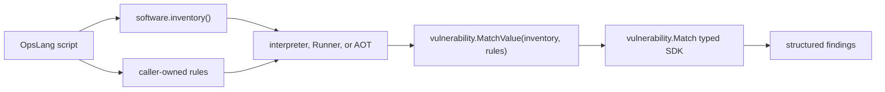

# 漏洞匹配原子操作技术设计

Feature Name: vulnerability-op-integration
Updated: 2026-09-06

## 描述

现有 `pkg/ops-core-sdk/vulnerability` 提供强类型 `Match(software.InventoryResult, []Rule) []Finding`。OpsLang 解释器和 Runner 使用 `map[string]interface{}`、`[]interface{}` 表示运行时值，AOT 生成代码也以 `interface{}` 承载表达式结果。本设计增加一个严格动态值适配入口，并由三套引擎统一调用。

公开操作固定为 `vulnerability.match(inventory, rules)`。操作不采集软件清单，调用方显式传入 `software.inventory()` 的结果，因此脚本可以缓存、过滤、回放或测试清单。

## 架构



`internal/opsspec/spec.go` 继续作为名称、参数、只读属性和引擎可用范围的单一事实来源。解释器桥接、Runner registry 和 AOT codegen 分别实现调用映射，一致性测试锁定公开契约。

## 组件与接口

### 动态值适配器

在 `pkg/ops-core-sdk/vulnerability` 增加：

```go
func MatchValue(inventoryValue interface{}, rulesValue interface{}) ([]Finding, error)
```

适配器执行以下逻辑：

```text
accept software.InventoryResult directly for AOT calls
validate other inventoryValue inputs are non-nil objects
accept []Rule directly and dynamic lists, where nil is treated as an empty list
JSON-encode inventoryValue and decode into software.InventoryResult
for each rule value:
    validate the value is an object
    JSON-encode the value and decode into Rule
    attach the rule index to conversion errors
call Match with typed inventory and rules
return findings
```

强类型值直接复用，动态值使用 JSON 转换，与现有解释器 `structToMap`、AOT `opsNormalize` 和 Runner 指令协议保持字段语义一致。解码允许未知字段，便于软件清单和规则模型向后扩展。

### 原子操作规范

`internal/opsspec/spec.go` 增加：

```go
{Name: "vulnerability.match", Args: []string{"inventory", "rules"}}
```

`Mutating` 保持默认值 `false`，可用范围保持三引擎默认值。

### 解释器

`internal/interpreter/sdk_bridge.go` 注册 `vulnerability.match`，严格要求两个参数，调用 `MatchValue`，再通过 `structToMap` 将 typed slice 转为动态列表。

### Runner

`internal/runner/registry.go` 注册 `vulnerability.match`。注册函数检查 `inventory` 与 `rules` 参数是否存在，将值传给 `MatchValue`，并透传带操作名前缀的错误。

### AOT 编译器

`internal/compiler/codegen.go` 增加 SDK 映射和 import path：

```text
vulnerability.match -> vulnerability.MatchValue(interface{}, interface{})
```

参数转换标记使用现有任意值参数类型，使字典、列表和变量表达式均可传入。生成调用沿用现有错误传播和 `opsNormalize` 结果归一化流程。

## 数据模型

输入清单沿用 `software.InventoryResult`，输入规则沿用 `vulnerability.Rule`，输出沿用 `vulnerability.Finding`。本功能不增加持久化模型和协议版本。

Runner 指令参数示例：

```json
{
  "op": "vulnerability.match",
  "args": {
    "inventory": {"host": "host1", "os": "linux", "packages": []},
    "rules": [{"id": "CVE-EXAMPLE", "package": "openssl", "fixed_version": "3.0.1"}]
  },
  "assign": "findings"
}
```

## 正确性属性

- 三套引擎公开完全相同的规范名称和参数顺序。
- 动态值转换成功后，结果与直接调用强类型 `Match` 相同。
- 空规则列表产生非 nil 空列表，JSON 输出为 `[]`。
- 输入转换失败时不产生部分 findings。
- 匹配过程不修改传入清单、规则或主机状态。
- Debian 和 RPM 软件包继续使用各自权威版本语义。

## 错误处理

- 缺少参数：返回包含操作名和参数名的错误。
- inventory 类型错误：返回 `inventory must be an inventory value or object`。
- rules 类型错误：返回 `rules must be a rule slice or list`。
- 单条规则类型错误：错误包含 `rules[index]`。
- JSON 编解码错误：保留原始错误并增加输入上下文。
- 规则业务字段缺失：沿用 `Match` 的零误报策略，跳过无效规则。

## 测试策略

- SDK 单元测试覆盖有效动态输入、AOT 强类型输入、空规则、nil、错误 inventory、错误 rules、错误规则项和未知字段。
- 解释器测试覆盖脚本字典/列表输入、结果成员访问和参数数量错误。
- Runner 测试覆盖 JSON 形状输入、缺少参数和结构错误。
- AOT codegen 测试覆盖 import、调用映射及两个任意值参数。
- 跨引擎一致性测试覆盖公开名称集合和参数签名。
- 示例执行测试覆盖 `software.inventory()` 到 `vulnerability.match()` 的完整本地链路。
- 全量验证执行 `go test ./...`、`go vet ./...`、文档新鲜度检查和多平台静态构建。

## 兼容性

新增操作不会修改已有指令协议。旧 Runner 遇到新操作会按现有行为返回未知操作错误，因此控制端与 Runner 应使用同一版本发布。Go SDK 的现有 `Match` 签名保持稳定。

## 参考

[^1]: `pkg/ops-core-sdk/vulnerability/vulnerability.go` - 强类型规则匹配实现。
[^2]: `internal/opsspec/spec.go` - 原子操作单一事实来源。
[^3]: `internal/opsspec/consistency_test.go` - 三引擎一致性约束。
