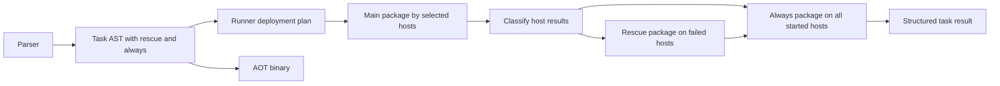

# Task Automatic Rollback

Feature Name: task-automatic-rollback
Updated: 2026-09-07

## Description

OpsLang 使用任务级 `rescue` 和 `always` 子句表达显式补偿与收尾动作。该语法延续现有 `block/rescue/always` 的错误处理模型，同时把远程部署的失败作用域固定到单台主机。

任一主机的主操作失败时，控制器只在该失败主机执行 `rescue`。主操作成功的主机保留成功状态。完成失败主机的 `rescue` 和所有适用的 `always` 后，控制器停止后续任务。变更操作包不自动重放，现有连接、探测、上传等传输级重试继续生效。

## Syntax

```ops
task "deploy_app" on "web" {
    file.copy("/tmp/app.new", "/opt/app/app")
    service.restart("app")
}
rescue {
    file.copy("/opt/app/app.bak", "/opt/app/app")
    service.restart("app")
}
always {
    file.delete("/tmp/app.new")
}
```

`rescue` 和 `always` 保持可选，并沿用现有关键字，不增加语言关键字数量。

## Architecture



## Execution Semantics

### Runner Mode

The controller generates one `deployStep` with up to three instruction packages:

```text
main targets = task-selected targets
main results = execute main package once
failed targets = hosts whose main result is not success

if failed targets is non-empty and rescue exists:
    execute rescue package once on failed targets

started targets = hosts represented in main results
if always exists:
    execute always package once on started targets

merge main, rescue, and always results per host
if failed targets is non-empty:
    stop before the next deploy step
```

Runner packages reuse protocol version `1.0`. Main, rescue, and always package identity is represented by task IDs ending in `-main`, `-rescue`, and `-always`. The transport format remains compatible because each package is independently valid under the current schema.

### AOT Mode

AOT preserves local task semantics inside the generated binary. A task compiles as an error boundary around its main body:

```text
execute main body
if main body fails and rescue exists:
    expose the failure as _error
    execute rescue body
execute always body after main or rescue
propagate the main error when rescue is absent
propagate the rescue or always error when either fails
```

Current AOT deployment rejects task-level target routing. This feature retains that boundary. AOT scripts without task-level routing receive task compensation semantics inside each uploaded binary.

## Components and Interfaces

### AST

`ast.TaskStatement` gains two optional fields:

```go
Rescue *BlockStatement
Always *BlockStatement
```

The fields mirror `BlockRescueStatement` and allow existing traversal logic to reuse the same concepts.

### Parser

`parseTaskStatement` parses the task body followed by optional `rescue` and `always` clauses in that order. Source positions continue to come from lexer tokens. A standalone `rescue` or `always` remains a parser error.

### Instruction Generation

`InstructionGenerator` keeps `Generate` focused on the task main body. A new block-oriented generation entry point creates an independent package from `Rescue` or `Always`, using the same privilege value and dry-run flag.

Each package receives a fresh generator state, preventing assignments from the main package from leaking into compensation. This is intentional: compensation must gather any required remote state explicitly and cannot depend on controller-memory variables from a failed package.

### Deployment Plan

`deployStep` changes from a single package to this shape:

```go
type deployStep struct {
    name    string
    targets []opsexec.Target
    main    *runner.InstructionPackage
    rescue  *runner.InstructionPackage
    always  *runner.InstructionPackage
}
```

Package configuration injection and signing run independently for every non-nil package.

### Result Model

The aggregate keeps one terminal host status while retaining phase details:

```go
type deployHostResult struct {
    Status   string             `json:"status"`
    Main     *opsexec.HostResult `json:"main"`
    Rescue   *opsexec.HostResult `json:"rescue,omitempty"`
    Always   *opsexec.HostResult `json:"always,omitempty"`
}
```

Terminal status rules:

| Main | Rescue | Always | Terminal status |
|------|--------|--------|-----------------|
| success | absent | success or absent | success |
| failed | success | success or absent | rolled_back |
| failed | failed | any | rollback_failed |
| any | any | failed | cleanup_failed |

`cleanup_failed` has precedence because the host exits with an unresolved cleanup failure. Main and rescue fields retain the prior history.

### Audit

The existing audit payload receives the richer deploy aggregate through the normal result path. Phase package IDs and result timestamps provide execution order. No secret, password, private key, or vulnerability service token enters the result.

## Correctness Properties

1. Every task-selected host has exactly one main result.
2. A rescue result exists only for a host whose main result failed.
3. A host receives at most one rescue execution per task.
4. A host receives at most one always execution per task.
5. The next task starts only when every main result succeeded.
6. Main, rescue, and always packages pass privilege validation and signature verification independently.
7. Dry-run packages preserve phase ordering and perform zero mutating SDK operations.
8. Aggregate status is derivable from retained phase results without hidden state.

## Error Handling

- Parser errors identify invalid clause order and source position.
- Package generation errors identify the task name and phase.
- Transport failures produce normal host failures and participate in compensation decisions.
- Main operation failures trigger rescue directly without operation replay.
- Rescue failures produce `rollback_failed` and preserve the main failure.
- Always failures produce `cleanup_failed` and preserve preceding phase results.
- Context cancellation records a phase-specific failed result for hosts prevented from starting.
- Signing or configuration injection errors stop deployment before the affected package contacts hosts.

## Security

- Privilege analysis traverses all task phases.
- Production approval summaries include mutating calls from all phases.
- Every phase package is signed independently after dry-run and remote configuration fields are finalized.
- Runner runtime privilege checks apply to every phase package.
- `_error` is available only inside AOT/interpreter rescue execution. Runner compensation receives failure information through structured controller results and does not interpolate error text into instruction arguments.

## Test Strategy

### Parser and AST

- Parse task body only, body plus rescue, body plus always, and all clauses.
- Reject reversed clauses and standalone clauses with line and column assertions.
- Verify task string rendering indicates optional phases.

### Mode and Privilege

- Verify mode selection preserves task compensation semantics.
- Verify read-only scripts reject mutating calls in rescue and always.
- Verify approval discovery includes mutating compensation operations.

### Runner Plan

- Generate independent packages for each phase.
- Assert no main assignment leaks into rescue generation state.
- Assert dry-run, privilege, task ID suffix, validation, and signing for each package.

### Deployment Orchestration

- All main hosts succeed: skip rescue, run always, continue next task.
- Partial main failure: rescue failed hosts only, run always on all started hosts, stop next task.
- Rescue failure: return `rollback_failed` with both error chains.
- Always failure: return `cleanup_failed` while retaining earlier results.
- Empty target and cancelled-context cases return asserted structured errors.

### AOT

- Generated program runs rescue after a failing main operation.
- Generated program runs always after success and failure.
- Generated program propagates rescue and always failures with exact messages.
- Linux amd64 and arm64 static builds pass through the existing build matrix.

## Rollout

1. Add AST and parser support with parser tests.
2. Extend privilege and mode traversal.
3. Add phased Runner package planning.
4. Add host-scoped orchestration and result aggregation.
5. Extend AOT task code generation using the existing block rescue machinery.
6. Update language, CLI, architecture, and status documentation.
7. Run full tests, vet, documentation checks, and cross-platform builds.

## References

- `.monkeycode/docs/ARCHITECTURE.md`
- `internal/ast/ast.go`
- `internal/parser/parser.go`
- `internal/runner/instruction_gen.go`
- `internal/compiler/codegen.go`
- `cmd/opsctl/deploy.go`
- `internal/security/retry.go`
